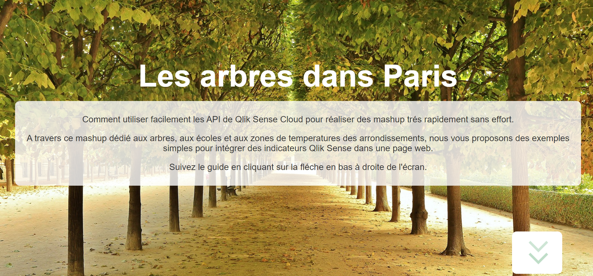
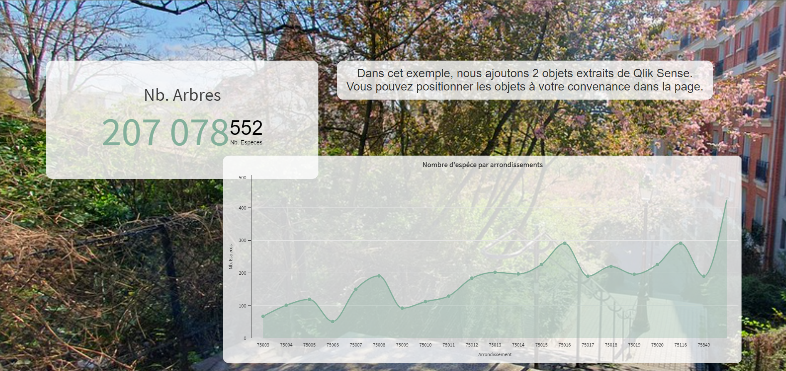

# Qlik Arbres

[](https://opensource.org/licenses/ISC)

This project propose a mashup Qlik with embed (webcomponent). The use case is a frensh website around a trees in Paris. It's interesting to positionning trees and School with a tempature zone.

This example proposes easy to complex mashup integrations.

__Homepage__


__page__


## Getting Started

Before we get started, you'll need to install Node and npm (or Yarn).

### Contributing

Add .env file with parameter

```.env
PROJECT_NAME="Arbres Mashup Qlik"
TENANT_URL="https://<tenant>.eu.qlikcloud.com"
APP_ID="<app_id>"
WEB_INTEGRATION_ID="<web_integration_id>"
```

#### Managing web integrations

You can create web integrations to add origins that are allowlisted to access the tenant. The web integration containing the allowlist is connected to an ID used in for example a mashup that is connecting to your tenant. When a request arrives, Qlik Cloud confirms that the request derives from an allowlisted domain and then approves the request, else not.

source : https://help.qlik.com/en-US/cloud-services/Subsystems/Hub/Content/Sense_Hub/Admin/mc-adminster-web-integrations.htm

## Installation Qlik mashup

Install package

```bash
npm install
```

Start a local server using:

```bash
npm run server
```

Start a dev on local machine using:

```bash
npm run dev
```

Check version npm package on package.json

```bash
npx npm-check-updates -u
```
